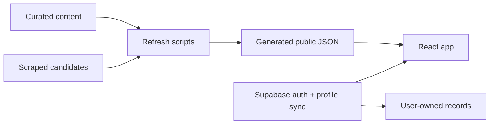

# Loci
Loci is a candidate intelligence platform for scholarships, graduate trainee applications, and exam preparation.

It started as an IELTS study workspace, and it is now being shaped into a broader product that helps ambitious candidates move from scattered information to action: discover opportunities, score fit, track applications, and keep practice tied to real application goals.

---

## Why this matters
High-achieving candidates do not usually lose because they lack ambition. They lose time in the gaps between sources:

- scholarships hidden across inconsistent websites and PDFs
- deadlines that change without warning
- eligibility rules that are hard to compare
- application checklists scattered across notes, email, and spreadsheets
- test preparation disconnected from the actual opportunities they want

Loci is designed to turn that chaos into a structured workflow. The long-term vision is a single workspace that helps a candidate understand what they qualify for, what they need to submit, and what they should work on next.

---

## Product Direction
The target product has four surfaces:

- `Home` for blockers, urgency, and next actions
- `Scholarships` for discovery, matching, and shortlist management
- `Practice` for IELTS and aptitude preparation
- `Account` for structured profile data and sync

The current codebase still includes the original IELTS practice experience, but the architecture is being extended toward the wider Loci workflow.

---

## What is live today
The current build includes:

- a routed React/Vite frontend
- IELTS practice content with session history
- scholarship browsing and shortlist support
- Supabase-backed email auth and profile sync
- content refresh scripts for questions, passages, and scholarships
- security hardening for input handling, logging, and safe error messaging
- a Supabase migration that defines the initial schema for profiles, practice sessions, scholarships, and application tracking

This is still early-stage product work, not a finished commercial platform. The important part is that the core workflow is now structured enough to grow without needing a rewrite.

## How matching works
The scholarship engine is intentionally conservative. It does not try to infer a perfect fit from loose keywords. Instead, it compares the candidate profile against the scholarship record in layers:

- hard filters remove opportunities the candidate clearly cannot pursue
- eligibility fields check nationality, degree class, discipline, language tests, and experience
- coverage fields show whether the opportunity is worth the effort
- application fields measure deadline pressure and document burden
- provenance fields lower confidence for weak extractions so poor records do not outrank reliable ones

The result is a fit score that supports decision-making rather than replacing it. The list is organized around effort, urgency, and confidence, not just keyword overlap.

---

## Architecture
The core principle is simple: content is decoupled from the UI.

The app reads generated JSON from `public/data/`. Content is prepared by scripts in `scripts/`, not hardcoded into the React views. That gives us three advantages:

- the UI stays fast
- content updates do not require code changes
- scoring, scraping, and presentation can evolve independently

### Data flow



### Current content pipeline

- `content/` holds curated and scraped source material
- `scripts/refresh-content.mjs` merges and normalizes content
- `public/data/` holds the generated files consumed by the UI
- `content/validation-failures.json` captures scraped records that failed validation

### Supabase layer

Supabase is used for:

- auth
- profile rows
- practice session storage
- shortlist storage
- future application tracking

The schema is intentionally broader than the current UI so the product can grow into the Loci workflow without another schema reset.

### Future document intake
Today the matching model expects pasted profile text because it is the simplest way to validate the scoring logic. The next step is document upload:

- users upload CVs, transcripts, and supporting documents as PDF or DOC/DOCX files
- the backend extracts text and maps it into the structured profile model
- parsing should happen server-side so private documents are not exposed to the client unnecessarily
- extracted fields should be shown back to the user for confirmation before scoring changes
- if parsing fails, the system should fall back to pasted text rather than block the workflow

The goal is not just file upload. It is turning unstructured documents into a transparent candidate profile that can be scored, audited, and reused.

---

## Repository shape

```text
content/      source JSON for questions and scholarship candidates
public/data/  generated JSON consumed by the app
scripts/      refresh, scrape, and validation scripts
src/          React application and local services
supabase/     initial database schema and notes
```

---

## Status
The repository is in active development. The current product is still heavily informed by IELTS prep, but the direction is now broader: a structured candidate workspace for scholarships and graduate applications.

The next major milestones are:

1. structured candidate profiles
2. scholarship fit scoring
3. application tracking
4. urgency ranking
5. better separation of the four product surfaces

---

## Local development

```bash
npm install
npm run content:refresh
npm run content:scrape-scholarships
npm run dev
npm run build
```

---

## License
MIT.
