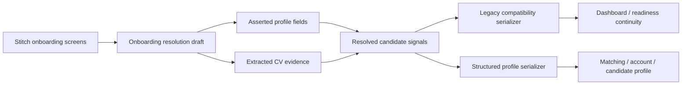

# Onboarding Migration Blueprint

This document defines how the new Stitch onboarding package should replace the current onboarding flow without breaking profile persistence, readiness, scholarship matching, or CV import.

## Goal

Replace the current `/onboarding` experience with the newer Stitch onboarding package from `stitch_adaptive_feature_experience (1).zip`, while turning onboarding into the app's first profile-resolution workflow instead of a standalone form wizard.

The migration should:

- preserve current profile writes and route behavior
- improve how extracted CV data is reviewed and confirmed
- keep dashboard and readiness working during rollout
- move matching closer to a resolved candidate profile model

## Current reality

The app currently has two overlapping profile systems.

### Legacy onboarding fields

These are still consumed directly in the app:

- `target_band`
- `self_assessment`
- `test_date`
- `target_modules`

They currently drive:

- dashboard readiness snapshots
- countdown notifications
- onboarding completion assumptions
- some readiness blockers

### Structured profile fields

These are the stronger long-term profile fields:

- `identity`
- `academic`
- `professional`
- `languageTests`
- `applicationCycle`
- `targetDegreeLevel`
- `targetDisciplines`
- `targetCountries`

They currently drive:

- scholarship matching
- account verification
- profile completion
- candidate profile resolution

### Shadow profile enrichment

CV import already creates a richer extracted and resolved candidate shape through:

- `candidateProfile.extracted`
- candidate profile snapshots
- semantic profile generation

This is the right architectural direction. The onboarding rewrite should align with it, not create a third parallel model.

## What the Stitch package gives us

The May 16, 2026 zip includes:

- desktop extraction flows
- mobile extraction flows
- desktop alignment flows
- mobile alignment flows
- a mobile verdict flow
- extraction edge-case screens
- a newer design system than the repo-local `.design-ref` package

The package is useful as a visual and interaction reference, but it is not a complete production spec.

## Non-canonical content in the zip

Some screens contain placeholder or cross-project content and must not be implemented literally.

Known examples:

- `Missing LSAT Writing Sample`
- copy referring to "the world's most elite opportunities"
- alignment copy that says `VERDICT will tailor your readiness diagnostic`
- non-Loci regional or institutional references

Implementation rule:

- keep layout, component rhythm, spacing, and state structure
- rewrite product copy to fit Loci's actual scholarship and IELTS domain

## Canonical migration approach

We should not do a pure UI swap.

Instead, onboarding becomes a staged profile-resolution workflow with a compatibility serializer.

### Architecture



### Why this is the recommended path

- It lets the new onboarding feel real instead of decorative.
- It uses the same profile concepts already present in matching.
- It preserves current downstream consumers while we migrate them.
- It gives the edge-case screens a real behavioral purpose.

## Screen strategy

The Stitch package should map to four workflow states, not three unrelated mockups.

1. Extraction
2. Verification
3. Alignment
4. Verdict

### Extraction

Purpose:

- accept CV or dossier upload
- show parser confidence
- expose low-confidence and missing-data states
- seed profile fields from extracted data

Primary source references:

- `onboarding_intelligence_extraction_revised`
- `onboarding_intelligence_extraction_mobile_enhanced`
- `onboarding_intelligence_extraction_edge_case_handling`

### Verification

Purpose:

- confirm extracted identity, academic, professional, and language signals
- resolve conflicts between extracted and asserted values
- prevent silent low-confidence matches from leaking into the ranking layer

This state does not exist as an isolated screen in the current React onboarding and needs to be made explicit.

### Alignment

Purpose:

- confirm target degree level
- confirm target countries
- confirm target disciplines
- choose scholarship priorities or tracks
- preview ranked directions without treating them as final truth

Primary source references:

- `onboarding_target_alignment_revised`
- `onboarding_target_alignment_mobile`

### Verdict

Purpose:

- summarize profile strength
- show next blockers
- confirm what is ready now
- hand the user into Dashboard, Readiness, Scholarships, or Practice

Note:

- the mobile verdict screen is not fully canonical because the content is contaminated
- we should preserve the visual treatment, not the literal text

## Replace vs connect

### What should be replaced now

- the JSX and state flow inside `src/components/OnboardingForm.jsx`
- the current onboarding CSS block in `src/styles.css`
- the assumption that onboarding is only a three-step wizard

### What should remain connected for now

- `/onboarding` route in `src/App.jsx`
- `saveOnboarding()`
- `saveOnboardingProfile()`
- CV import handoff through `handleCvImport`
- `normalizeProfileRecord()`
- dashboard and readiness compatibility with legacy onboarding fields

### What should not be replaced in phase one

- scholarship matching persistence
- account verification page
- candidate profile snapshot persistence
- session-based readiness logic

## Canonical onboarding draft model

The replacement flow should use a richer local state model.

```ts
type OnboardingResolutionDraft = {
  extraction: {
    intake: DocumentIntake | null
    confidence: number | null
    issues: Array<{
      key: string
      severity: "low" | "medium" | "high"
      title: string
      detail: string
      action?: string
    }>
  }
  asserted: {
    displayName: string
    identity: {
      nationality: string
      countryOfResidence: string
    }
    academic: {
      degreeClass: string
      discipline: string
      disciplineCategory: string
      institution: string
      institutionCountry: string
      graduationYear: string
      cgpa: string
      cgpaScale: string
    }
    professional: {
      workExperienceYears: string
      currentlyEmployed: string
      sector: string
    }
    languageTests: {
      ielts: string
      toefl: string
      celpip: string
      ieltsBands: {
        reading: string
        listening: string
        writing: string
        speaking: string
      }
    }
    targets: {
      applicationCycle: string
      targetDegreeLevel: string
      targetDisciplines: string[]
      targetCountries: string[]
      targetTracks: string[]
      targetBand: string
      testDate: string
      targetModules: string[]
    }
  }
  resolved: {
    nationality: unknown
    discipline: unknown
    degreeClass: unknown
    languageTests: unknown
    workExpYears: unknown
  }
  workflow: {
    currentStep: "extraction" | "verification" | "alignment" | "verdict"
    completedSteps: string[]
  }
}
```

## Data contracts we must preserve

Even if the new screens do not explicitly expose every field in the zip, phase one must keep writing these:

### Structured profile outputs

- `identity`
- `academic`
- `professional`
- `languageTests`
- `applicationCycle`
- `targetDegreeLevel`
- `targetDisciplines`
- `targetCountries`

### Legacy compatibility outputs

- `target_band`
- `self_assessment`
- `test_date`
- `target_modules`

### Why

These fields are still read in:

- dashboard snapshots
- readiness blockers
- test-date notifications
- shell summary state
- matching eligibility checks

## Matching implications

The current matching engine scores and blocks mainly on:

- nationality
- discipline
- degree class
- overall IELTS / TOEFL / CELPIP
- work experience
- deadline
- provenance confidence

This is strong, but it does not yet fully reward the richer onboarding experience.

### Current mismatch

The onboarding flow collects:

- IELTS target band
- IELTS sub-band self-assessment
- target directions
- inferred dossier signals

But the scholarship engine mostly relies on:

- overall language test scores
- resolved nationality
- resolved discipline
- resolved degree class

### Required phase-two logic work

After the UI migration lands, matching should be improved to:

1. use verified extracted language scores more explicitly
2. allow per-band IELTS logic where scholarship criteria support it
3. use target degree level and target countries as more meaningful ranking signals
4. reflect unresolved extraction conflicts as explainable blockers

## What can block implementation

### Product blockers

- no canonical desktop verdict screen in the zip
- no designed first-run save-success state
- no designed returning-user resume state
- no explicit date-selection treatment for `test_date`
- no clear visual treatment for explicit overall IELTS entry versus sub-band entry

### Technical blockers

- current onboarding files already have local edits
- the app still has mixed dependence on legacy and structured profile fields
- extraction is heuristic, not OCR-grade, so edge-case UI must not overpromise

### Content blockers

- contaminated placeholder copy in the zip
- unclear final naming for tracks and strategic insights
- some target alignment cards look aspirational rather than data-driven

## Screenshots still needed or decisions still required

The existing zip is not enough to remove every ambiguity. These references or decisions are still needed:

- canonical desktop verdict design
- post-save transition state
- low-confidence extraction confirmation state
- conflict-resolution state for extracted versus asserted fields
- date-entry design for IELTS test date
- final copy direction for strategic insights and blockers

## Phased rollout

### Phase 1: Blueprint and state model

- define canonical onboarding resolution draft
- preserve serializers for both structured and legacy fields
- document canonical screen ownership

### Phase 2: UI replacement

- replace `OnboardingForm` structure
- implement desktop and mobile layouts from Stitch package
- wire extraction, verification, alignment, and verdict states

### Phase 3: Compatibility stabilization

- ensure dashboard still reads expected fields
- ensure readiness still resolves blockers correctly
- ensure account page reflects saved profile changes

### Phase 4: Matching alignment

- improve how onboarding outputs affect scholarship ranking
- surface extraction uncertainty more clearly in match explanations
- reduce reliance on duplicated profile assumptions

### Phase 5: Legacy field reduction

- migrate dashboard and readiness off legacy-only assumptions
- narrow the serializer footprint
- treat structured and resolved profile data as the primary source of truth

## Immediate implementation tasks

1. Create a new onboarding resolution draft model alongside the current onboarding helpers.
2. Split onboarding UI into explicit extraction, verification, alignment, and verdict sections.
3. Keep `/onboarding` and `saveOnboarding()` stable during the rewrite.
4. Add a compatibility serializer that writes both structured profile fields and legacy onboarding fields.
5. Add a follow-up scoring pass to better consume verified onboarding outputs.

## Bottom line

The onboarding rewrite should not be a cosmetic restyle.

It should become Loci's first canonical profile-resolution workflow:

- extract
- verify
- align
- diagnose

with compatibility preserved until the rest of the app fully catches up.
