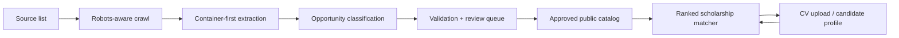

# Scholarship and Graduate Opportunity Pipeline

Loci is designed for people who want to move beyond local listings and toward opportunities that change their trajectory:

- international scholarships
- overseas or open-to-all funding
- graduate trainee and early-career roles
- application workflows that can be explained and audited

## What we optimize for

We do not want a generic feed of random pages, tag pages, or article blurbs. We want records that behave like real opportunities:

- a single primary title
- a primary application or detail link
- eligibility language that can be parsed
- a deadline or at least a trustworthy application path
- enough source confidence to justify ranking

## Scraping methodology

The scraper follows a container-first approach.

1. Discover pages from source-specific entry points.
2. Respect robots rules and block obvious dead or irrelevant paths.
3. Parse the page inside a known container before falling back to page-wide text.
4. Capture the primary CTA or title link, not just any anchor inside the card.
5. Classify the record before publication:
   - scholarship
   - fellowship
   - graduate trainee
   - internship / early career
   - local-only or Nigeria-only
6. Push suspicious items into review instead of publishing them immediately.

## Prioritization rules

Records rank higher when they show one or more of these signals:

- international, overseas, global, abroad, or open-to-all language
- graduate trainee, graduate programme, management trainee, or early-career wording
- direct application link or clearly scoped detail page
- deadline and eligibility text that can be extracted cleanly
- strong source confidence

Records are deprioritized or dropped when they look like:

- list pages
- category pages
- article pages with no real application target
- Nigeria-only or local-only opportunities when the goal is broader mobility

## Backend workflow

The backend is split into clear stages so each stage can be audited.

### Stage 1: Crawl

Source profiles define:

- entry paths
- follow patterns
- application patterns
- priority patterns
- ignore patterns

This lets us bias the crawl toward international and graduate-trainee content instead of crawling every internal page equally.

### Stage 2: Extract

Extraction should prefer:

- the listing card container
- the card title
- the primary CTA or canonical detail link
- the deadline or application section inside the detail page

If the page is dynamic, Playwright is the fallback because it can wait for rendered content and inspect the DOM after hydration.

### Stage 3: Classify

Every candidate record is tagged with:

- `opportunity_type`
- `audience_scope`
- `priority_score`
- `priority_reasons`

This makes the feed explainable and makes the ranking layer easier to debug.

### Stage 4: Review and publish

Records enter a review queue before publication. Only records with enough evidence and the right opportunity shape are pushed into the public catalog.

### Stage 5: Match

The matcher combines:

- eligibility
- coverage
- deadline pressure
- source confidence
- opportunity priority

This keeps the product aligned with the original vision: helping candidates find realistic, higher-value opportunities faster.

## Backend scheduling

The cleanest orchestration pattern is:

- a scheduled job pulls fresh content
- the scraper writes a review queue
- reviewed records are promoted to the approved catalog
- the public JSON is regenerated
- the app loads the refreshed catalog automatically

In Supabase terms, this fits naturally with `pg_cron` and an Edge Function or database function that can run on a schedule.

